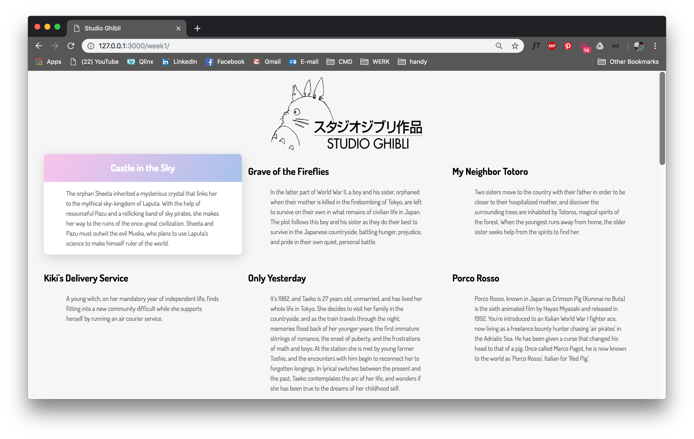

# Studio Ghibli API

## Table of contents
1. [Introduction](#Introduction)
2. [API](#API)
2. [Concept](#Concept)
3. [Hick-ups](#Hick-ups)
8. [To-do](#To-do)

## Introduction
For this course I chose to work with the [Studio Ghibli API](https://ghibliapi.herokuapp.com/#). [Studio Ghibli](https://nl.wikipedia.org/wiki/Studio_Ghibli) (株式会社スタジオジブリ) is a Japanese film studio responsible for a lot of anime-movies. Spirited away (2001) is my personal favorite and has been since it came out. This was the main reason I wanted to use this API.

## Concepts
Initially I wanted to use the moviedb API to create a tool for users to browse movies depending on the running time. Using my app users would be able to decide how much time they wanted to spend watching a movie. I found it difficult to think of some limitations (I wouldn't be able to render all the movies ever made) so I started looking for others.

Then I came across this API, and it was love on first sight. I want to show users what Studio Ghibli is and try to tell the stories behind the movies.

For the design I'd like to try some sort of horizontal scroll, something like a timeline. Every movie has it's own characters that I'd like to use to tell a story.

## Hick-ups

## To-do
- [x] Find API   
- [x] Connect to API
- [x] API connection using fetch()
- [ ] API connection using promises    
- [x] Show data in HTML (overzicht pagina)  
- [ ] Detail page   
- [x] CSS styling   
- [ ] CSS styling using BEM   
- [ ] Horizontal scroll (timeline)
- [ ] Connect backstories
- [ ] Implement movie player

## License
[MIT](LICENSE) © [Luna May Johansson](https://github.com/maybuzz)
